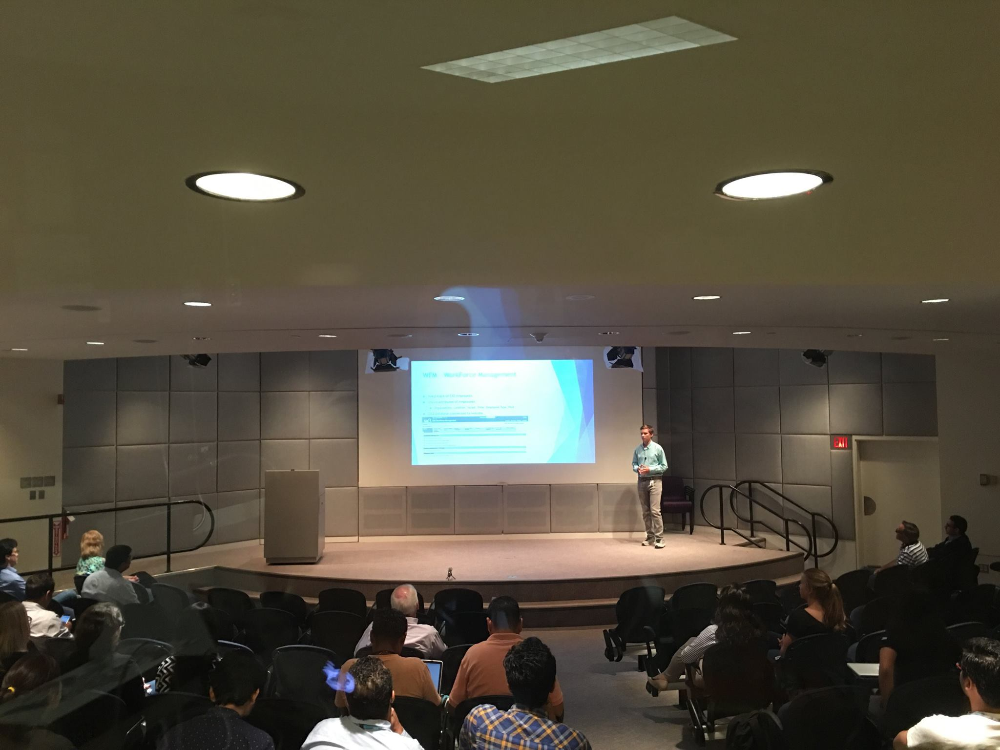

Presenting has always been my favorite activity to do work-related. During my time at Marist college, I often saw other classmates shiver at the thought of presenting to the entire class. I, on the other hand, always looked forward to these days. 

I never used to enjoy presenting, during high school I despised going up and talking about concepts that were boring to me. No, I do not want to present on a coming to age story or how the Louisiana Purchase was the best deal in North America history. Fortunately for me once at college I was able to present on fun things, things that I was actually interested and enthusiastic about. 

My first formal work related presentation was to the CIO, directors, and anyone who wanted to listen about a small application I created to display colocation metrics via GoogleMaps API. I was very excited, particularly because I was the only person presenting solo. All other presenters were a group of people but I was alone, with the full attention of very senior members of IBM.

I savored the moment and I felt like it went very well. I was approached afterwards by the CIO with complements and small talk about my project which was nice!

For 2.5 years at IBM I have not had another chance to present to an wider audience since then. Most of my presentations are towards my team or our clients which are fun, but they are over WebEx and are not as fun as an in person event.

Luckily I was provided an opportunity to speak at Toolbox@IBM, where several strategic partners like Slack and Pagerduty came to talk about their products, and also educate IBMers of their tooling. Our team is heavily invested in PagerDuty and we rely on it to let us know if our services have gone down and also we use it to receive notifications on our phones, slack, email and SMS. I was reached out because of our usage of PagerDuty and was asked to present in collaboration with PagerDuty.

A PagerDuty Senior Solutions Specialist and I created a powerpoint deck to go through. I was about 15% of the slides and I tried to keep them less wordy and more to the point. When the time came to present people were slowly trickling in and we ended up filling the room before we started. 

The lady I worked with did an exceptional job at setting the stage for my piece, in which I described our archticture and how we are tightly integrated from a system and process level to PagerDuty. If you would like more details feel free to contact me on [LinkedIn](https://www.linkedin.com/in/john-kryspin-a593189b/)

I kept eye contact and tried not to speed too quickly through my content. I seldom even looked at my slides, and rather used the slides as a platform to tell a story. We both recieved some awesome questions about PagerDuty and I let everyone know that they can contact me on IBM's chat platform if they need help setting it up.

After the presentation was over and we were packing up our laptops and notes a man came over and introduced himself. I thought he was an IBMer who enjoyed the presentation but in actuality the man was a Director at PagerDuty. His first question was "How many of these talks have you done?" My response was of course that this was the first one I have done in years. He said he loved the presentation and he invited me to speak at the PagerDuty summit two weeks from then!

This event was a great chance for me to see if I still had it in me after being 2.5 years from my last formal presentation. With this talk completed I am on the prowel for more events to speak at. Presenting is so much fun for me and I cannot wait to see what the future may bring.