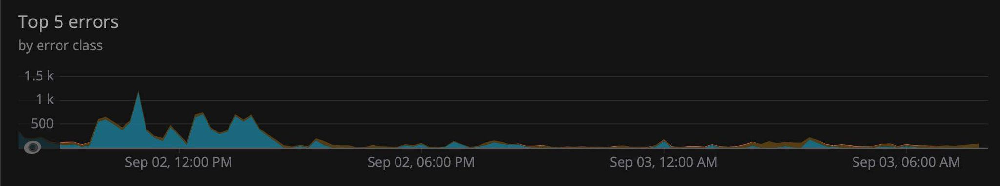
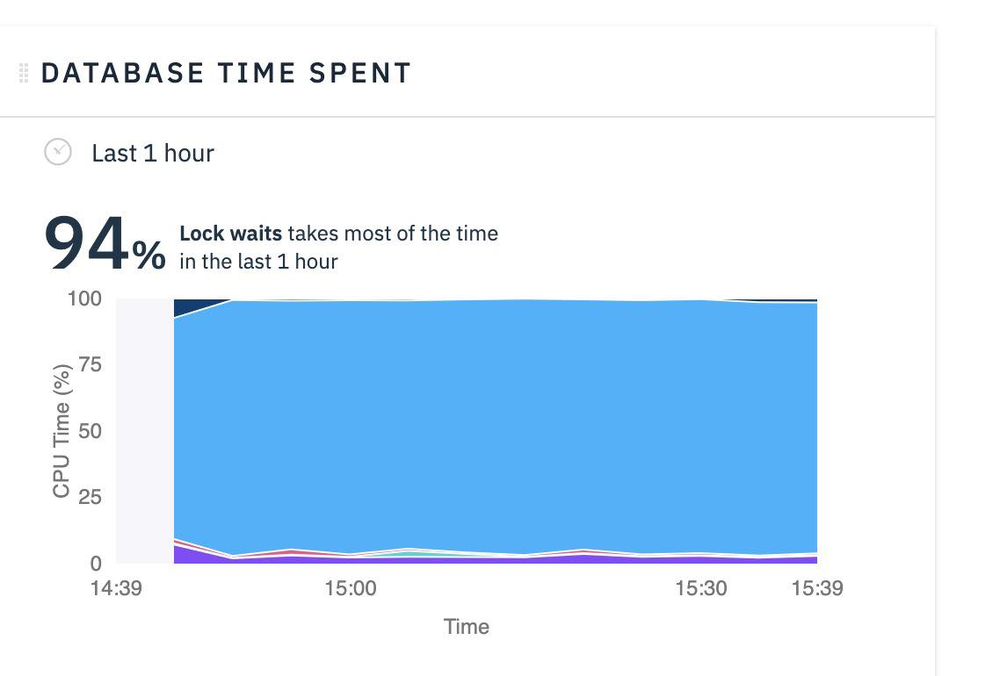
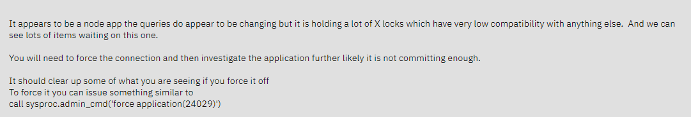

Often times when a new feature or solution is deployed there can be a vast change in the usage of backend services like a database or session cache.

For example, we recently deployed a change to IBM Training in which we moved all user and personalization data into our own database, rather than relying on another service. This move will allow us to control our own destiny and allow for more rapid changes and ability for a better user experience.

After all the work was completed on that migration and all the code changes were complete, we deployed the changes to production at 2am on on Wednesday.

For the first few days the application was performing great, everything was much faster than before and the data migration and code changes seemed successful.

The first indication that something was wrong was one night when we were pinged by our monitoring tool PagerDuty that the site had gone offline. This happened every so often even before we deployed our major change so we went ahead and restarted the server and everything seemed to work fine again.

A day or two later our team starts working on the next feature in the pipeline, but as we are looking at the production site we notice an extreme slowness. Everything was slow, including all our API calls, and some pages refused to load at all. This is when we knew we had an actual problem that we needed to fix ASAP.

Upon looking at the logs for both the application server which is Node.js and the proxy server which is using NGINX we found that there were an exorbitant amount of uncaught errors. We noticed that most of the errors were coming from the new APIs we built to handle having the user information hosted in our own database, so it seemed to align to our timeline and thus we got to solving it.

We made several changes to improve these APIs such as: exiting functions early if bad data was passed in, handling external API handling more gracefully, and surrounding any suspicious code in a try catch statement. We deployed these changes around 2:30 on September 2nd and we waited to see if anything improved.

The graph below shows the actual amount of errors over a 24 hour period of IBM Training



You can see that the error count dropped drastically right at 2:30pm. We were all relieved that the fix was working and slept great that night.

2 days later we awoke to find the site was have the same issues. We scanned the logs once again and found several errors we missed that were populating the logs and fixed them and deployed the fixes to production. Over the weekend we had no outages and the site was running smoothly.

Come Monday morning things were looking similarly good but when it came to be Tuesday morning the site grinded to a halt. Every API was extremely slow and hitting our timeout cap of 1 minute. Once again we checked the logs and found that the IBM DB2 database connection had died and was unable to reinitialize. This we our first glimpse into the core issue at hand.

Immediately everyone on the DevOps side hopped into a call as this was a SEV1 issue which means no one is working on anything else until it was fixed. First thing we did was restart the Node.js application and watch the logs.

Restarting it did the trick for awhile, but then the latency and slowness came back. One of my teammates took a look at our DB2 production instance to see if anything was wrong there and there was indeed a huge problem.



What this chart shows is that during the past hour 94% of the CPU Time being used was locks waiting to be revoked. For anyone unfamiliar a lock is granted to a database table when a query is ran against that table.

For example if I run this command:

```sql
SELECT * FROM MYSCHEMA.USERS;
```

A lock will be created on the USERS table until that query is completed and the lock is revoked.

We found that two of our largest tables, the profiles table and the transcripts tables, were being locked most often. And these tables were some of the additional tables we created as part of that major deploy I spoke of earlier.

After working with our database expert we found that the queries against the transcripts table were taking a huge amount of time to execute. We drilled into some of the queries and found that they were using a slower method of looking up data called a table scan. With this in mind we were able to add some indexes to the transcripts table to improve the performance by 97%.

Upon logging into our website there are a few queries that hit that table, so it is completely possible and likely that these queries were killing the performance of the DB2 instance.
We ran these indexes into production and watched the log for an hour and everything went well so we thought it was resolved. 4 hours later at 4:30pm we receive a notification from our PagerDuty integration that production is down, again.

After everyone got back into a call to see what was happening we reached a road block in which our team needed more information about the locks, but we did not have direct access into the DB2 instance as it is on IBM Cloud, and IBM Cloud doesn't give clients direct access into the DB2 Terminal.

We opened a SEV1 ticket with IBM Cloud in an attempt to see if they knew anything that could point us in the right direction.
They came back to us a few minutes later stating that there was a lock on an auxillary table which was blocking other tables. We were given a command to run in addition to a key nugget of information


> It appears to be a node app the queries do appear to be changing but it is holding a lot of X locks which have very low compatibility with anything else. And we can see lots of items waiting on this one.

> You will need to force the connection and then investigate the application further likely it is not committing enough.

> It should clear up some of what you are seeing if you force it off
> To force it you can issue something similar to
> call sysproc.admin_cmd('force application(24029)')

First we ran this command to boot the application which was causing the lock offline so that our production website would come back alive

```sql
call sysproc.admin_cmd('force application(24029)')
```

Then, as I was looking at the response to the ticket provided by IBM Cloud support I focused on this phrase:

`investigate the application further likely it is not committing enough.`

Hmm, I thought, I do remember having an issue before while running one of my jobs to do a mass update of data that I had to add some additional code to commit each query transaction.
What would happen in that code before my change is that my queries would start slowing down and failing eventually once I was a few thousand indexes into my loop of queries in that job.

With that code in mind I started googling the DB2 query protocol we used which is called Prepared Statements. After a few minutes of Googling I found this:

https://www.quora.com/What-is-the-effect-if-I-did-not-close-the-prepared-statement-in-JDBC

> When you don't close database resources after using them, they can remain allocated on the server, client or both. Say if you don't close a transaction or a connection, performance issues or even stability issues will occur both on the database server side as well as on the clients side. The limits on open cursors per session can be exceeded by not closing a result set or a statement. File descriptors limits can be exceeded, and ports exhausted if many new connections would be created with the database, or, if using a connection pool, the other tasks waiting for the access to database will be waiting for available connections and timeout. Memory can fill up and long transactions invite deadlocks or livelocks. So keeping transactions short, closing any resource eagerly as soon as not needed anymore are the ways to keep the database running efficiently.

<b>Memory can fill up and long transactions invite deadlocks or livelocks</b>

Remember this picture? Remember 94% of CPU time being spent on <b>Lock waits</b>?


With my newfound knowledge and hypothesis I went into our code and replaced our DB2 wrapper class with a different function which automatically closes statements when they are completed. By monkey-patching our old function to use this newer statement I tested all I could think of and we deployed it to pre-production and then production.

And once again, we waited.

After an entire 24 hours on what is a high traffic day, we no longer see any slowness in the site or and APIs failing.

The RCA (Root Cause Analysis) is that due to the increase of queries being run against our DB2, and due to the inefficient way in which queries were executed, many queries were being held by DB2 only to be closed after a certain interval. This means that when usage spiked on IBM Training, the tables would start locking thus causing any subsequent query to slow down and eventually timeout thus causing IBM Training to go offline.

Although our hypothesis was incorrect the first few times we thought we fixed it, I am glad that we learned more about some of the deep technicalities of our infrastructure. I hope I can share more stories about production issues and deep problems, even if in the end only a few lines of code needed to change.
